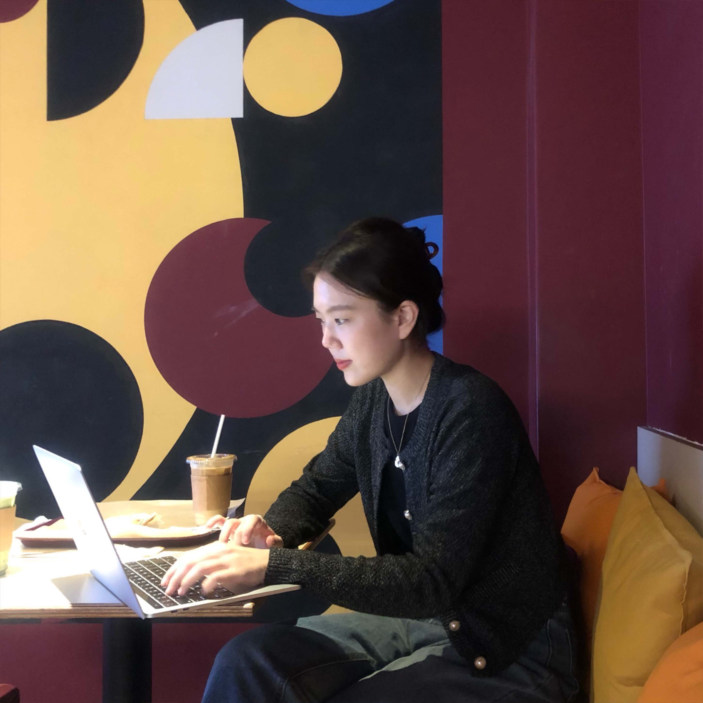

# Genie || Software Engineer, Frontend

9년 차, 상생을 꿈꾸는 개발자 최진희입니다.

## 최진희 (Jinhee Choi)

## 기본사항.

Email: genieechoii@gmail.com

✍🏻 Blog | [https://geniee.tistory.com](https://geniee.tistory.com/)

⚙️ Github | [https://github.com/realhee](https://github.com/realhee)

🪐 Portfolio URL | [Link](https://docs.google.com/presentation/d/e/2PACX-1vToR_l1Gv_Y_cjxiogIteYaOT3LpUIp4uabEHjP96ITnZZeGSj24oE6o_5TkJdkoeWlF-uIoBjNd7rj/pub?start=false&loop=false&delayms=3000&slide=id.p1) 

## 소개.

---

**UI/UX 플랫폼의 프레임워크 연구개발자**로, 프레임워크 의존 없는 VanillaJS 기반의 엔진 및 공통 컴포넌트 아키텍처를 설계해 왔습니다. 단순 기능 개발을 넘어 **기술 특허 출원**, **30억 규모 프로젝트 테크 리딩**, **DX(개발자 경험) 개선을 통한 버그률 40% 감축** 등 비즈니스와 팀 생산성에 직접적인 영향을 미치는 문제 해결을 즐깁니다.

## 경력.

---

### [투비소프트](https://www.tobesoft.com/main)

- 기간 | 2017-11 ~ 2026-06 (8년 8개월)
- 연구개발본부 넥사크로개발팀 | 책임 연구원
    - UI/UX 플랫폼 Nexacro 의 Framework 코어 개발 담당
    - 공통 인터페이스 설계 및 렌더링 성능 최적화
    - 신규 입사자 온보딩 주도 및 개발자 경험(DX) 및 협업 문화 개선
    - AI Agent 툴 도입으로 제품 별 유지보수 개발 워크플로우 개선

### [디지털다임](https://www.d2.co.kr/)

- 기간 | 2016-07 ~ 2016-08 (2개월)
- BX 부서 | 기획보조인턴
    - 나이스 정보통신의 가맹점 좌표 DB 관리를 위한 GoogleMaps API 구현
    - (주)영원무역 랜딩 페이지 와이어 프레임 작성 담당
    - 물류 관리 admin 페이지 QA 업무 수행

## 업무경험.

---

## 투비소프트

### [반응형 컴포넌트 구현 및 프로젝트 매니징](https://geniee.tistory.com/47)

- 기간 | 2주
    - 고정형 좌표계를 사용하던 제품 UI의 한계점 개선하여 모바일 사용성 증대
        - ResizeObserver 기반의 공통 반응형 인터페이스 설계
    - 기획 수립부터 공통 API 구현, 일정 관리를 총괄하며 프로젝트 테크 리딩 수행
    - 안정적 배포 및 추가 기능 제안으로 초기 1억원 규모 프로젝트를 30억 원으로 30배 확장

### [Abstract Component 기술 특허 출원](https://doi.org/10.8080/1020220159646)

- 기간 | 4개월
    - Low-code/No-code 환경 지원을 위해 시각적 UI 를 넘어 실행 환경에 따라 변경되는 추상화 구조 설계
        - DOM node와 컴포넌트 객체 간 1:N 대응 구조 도입
    - 대규모 엔터프라이즈 환경에서 재사용 가능한 확장형 공통 인터페이스 반영
    - 기술 특허 출원 완료 (출원번호: 10-2022-0159646)

### [Grid 컴포넌트 성능 최적화](https://www.playnexacro.com/#show:insight:888)

- 기간 | 3개월
    - 스크롤 성능 향상
        - HScroll 수행 시 가려지는 DOM 노드를 재사용하여 대용량 스크롤 성능 60% 향상
        - 태그 정보 일괄 적용을 통한 reflow, repaint 최소화로 pixel 계산 속도를 개선하여 경쟁사 대비 브라우저 렌더링 속도 30% 개선
    - 상태관리로 Map을 사용해 비교 반복문을 줄여 treeGrid의 addRow 기능 속도를 45% 개선
    - 대규모 트래픽에서도 안정적인 사용자 경험을 제공하기 위해 주기적인 리팩토링 진행

### [개발자 경험(DX) 향상 및 문서화 공수 절감](http://docs.tobesoft.com/module_developer_guide_nexacro_17_ko#00f2f845e72b9d9b)

- 기간 | 4개월
    - JSDoc 기반 자동 문서화 프로세스를 제안해 1200여개의 API 가이드 작성 공수를 60% 절감
    - OSMU(One Source Multi Use) 모듈화로 하나의 소스로 웹/모바일 환경에서 일관된 UX를 제공하여 고객의 개발 생산성 증대

### 웹 접근성(A11y) 표준 준수 및 SEO 최적화

- 기간 | 4개월
    - 대규모 서비스 고객(LH, 삼성전자 등)의 웹 접근성 유지보수 및 고도화 작업 수행
    - DOM 구조에 [시맨틱 마크업](https://www.playnexacro.com/#show:learn:4751)을 제공해 사이트 내용을 전달하여 SEO 및 웹 접근성 UX 개선
        - Google LightHouse SEO Performance 50% 향상
    - 파편화 된 접근성 코드를 모듈화하여 WCAG 준수율 90% 달성

### 신규 입사자 온보딩 및 개발 조직 문화 고도화

- 기간 | 진행 중
    - 신규 입사자/선임 대상으로 제품 교육 및 수습 프로젝트를 운영해 기술 적응 기간 약 2개월 단축
    - Azure Git PR 을 코드 리뷰 문화로 도입해 전 년 대비 버그 재작업률 40% 감소
    - P-n 룰 가이드라인으로 제안하여 팀 내 커뮤니케이션 비용을 절감 및 신규 입사자의 기술 적응 속도 향상
    - 팀 내 정기 기술 공유 세션을 운영하여 리팩토링과 프로세스 개선 주도

### [String Resource를 통한 다국어 지원](https://docs.tobesoft.com/development_tools_guide_nexacro_n_v24_ko/b622d58407f2af3a#623e21c214cf19b7)

- 기간 | 3개월
    - JSON 기반 언어 별 다국어 파일 정적 관리 시스템 구축
        - 화면/플랫폼 별 언어의 통합 관리로 기획자/개발자 간 협업 및 유지보수 효율성 증대
        - Drag & Drop 방식의 컴포넌트 바인딩 인터페이스로 UX 개선
    - XHR를 활용한 서버 데이터 로드 기능 구현

### MFE 컴포넌트 제품화

- 기간 | 3개월
    - 넥사크로 application에 종속적이던 기존 컨텐츠 로드 방식을 개선
    - MFE 기반 컴포넌트를 제공해 고객사의 보안 키보드 개발 효율과 외부 컨텐츠 사용성을 확장
    - application 내부에서 HTML 컨텐츠를 로드하고 유연한 컨텐츠 관리를 위해 native tag를 직접 접근할 수 있는 API 제공

## 활동.

---

### [[NEXTSTEP] 의식적인 연습 워크숍](https://edu.nextstep.camp/c/7FK82KZb)

- 기간 | 2025-08 ~ 2025-10
    - 우아한형제들 교육 기관(NEXTSTEP) 에서 진행한 오프라인 ai 워크숍
    - 프롬프트 엔지니어링 실무 적용으로 개발 및 업무 시간 단축 사례 발표

### [**[NEXTSTEP] 글쓰기 워크숍 3기**](https://edu.nextstep.camp/c/81psVr9U)

- 기간 | 2024-04 ~ 2024-06
    - 우아한형제들 교육 기관(NEXTSTEP) 에서 진행한 오프라인 저자 워크숍
    - 프롬프트를 이해하고 참여자들의 피드백을 받아 [ebook](https://bookk.co.kr/bookStore/667b6f2ea52b96ab870a0aa7) 출간
    - 공동 저자, 리뷰어, 출간 행사 기획 및 발표 역할 수행

### [[NEXTSTEP] **TDD, 클린 코드 with React 2기**](https://github.com/next-step/react-payments/pull/87)

- 기간 | 2023-02 ~ 2023-04
    - 모바일/데스크탑 타겟의 장바구니 페이먼츠 웹 앱 구현
    - **Storybook**을 사용해 Component Driven Development 기반 상향식 컴포넌트 설계
    - **MSW**를 통한 Backend API Mocking 및 React 상태 테스팅으로 DX 향상 경험
    - **Slack, Github Pull Request**을 통한 현업 실무진과의 코드 리뷰 경험

### [기술서적 독서 스터디](https://github.com/FrontendStudySeoul)

- 기간 | 2022-03 ~ 진행 중
    - OOP, MV* 패턴, 도메인과 UI, 상태 관리 등 심화 개념에 대한 토론 활동
    - 애자일 소프트웨어 공학 탐구 및 인사이트 공유
    - 클린 코드, 클린 아키텍처, 리팩터링-2판, You Don’t Know JS, 이펙티브 타입스크립트, 함께 자라기 등

### [**[keep-going] VanillaJS 클린 코드 스터디**](https://github.com/no-back)

- 기간 | 2022-02 ~ 2023-12
    - Github Organization 활동 경험
    - **번들러(Webpack, Vite) 코드 분석으로 boiler plate 구성**
    - **Cypress, Jest** E2E 테스트 진행

### [**[NEXTSTEP] Front-End 코드리뷰 스터디**](https://github.com/blackcoffee-study/moonbucks-menu/pulls)

- 기간 | 2020-11 ~ 2022-02 (5기, 6기, 13기)
    - VanilaJS를 이용한 SPA 개발
    - Github Pull Request를 통한 코드 리뷰 및 리팩토링 경험
    - 디스코드, 개더타운을 통한 pair programming 경험

## 교육.

---

### Vue.js 프로그래밍 실무 교육

- 기간 | 2020-06 ~ 2020-06 (2일)
- 교육기관 | KOSTA
    - node.js와 Vue.js를 통한 프로그래밍 실습 진행
    - 사내 Framework 구조 개선을 위한 공유 및 브레인스토밍 경험을 제시하여 사내 스터디 활동 진행

### **[NCS] 응용 SW엔지니어 및 Framework 개발자 양성과정**

- 기간 | 2017-03 ~ 2017-08 (6개월)
- 교육기관 | KH 정보교육원 역삼
    - 웹 프로그래밍 국비지원 교육 이수
    - JAVA, Oracle, HTML, CSS, JavaScript 활용한 웹 프로젝트 협업 경험

## 학력.

---

### 성신여자대학교 IT학부 정보미디어학 전공(컴퓨터S/W학 부전공) • 학사

- 기간 | 2012-03 ~ 2017-02 (4년 11개월)

## **수상.**

---

### [**서울시 좋은 간판 공모전 우수상 (서울특별시 주최)**](https://goodsign.seoul.go.kr/frt/biz/downldsgs/awarddnView.do?no=540&gubun=2)

- 기간 | 2015-09
    - 일러스트레이터와 디자인 툴을 이용한 3D 모델링 작업
    - 개인 경험을 토대로 기획 전담 및 협업 프로젝트 진행

## 기술스택.

---

- **Front-End & Core:** JavaScript(ES5/ES6+, VanillaJS), TypeScript, React, Next.js, HTML5/CSS3
- **State & Ecosystem:** Tanstack Query, Zustand, SCSS, Tailwind CSS
- Testing & Quality: Jest, Cypress, JSDoc, Storybook, MSW, Webpack/Vite
- DevOps & CI/CD: Azure DevOps (Git), TFS, Jenkins
- AI & Productivity: Claude Code, Antigravity